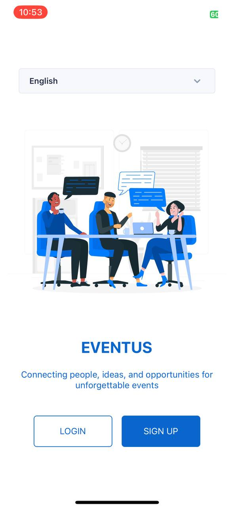
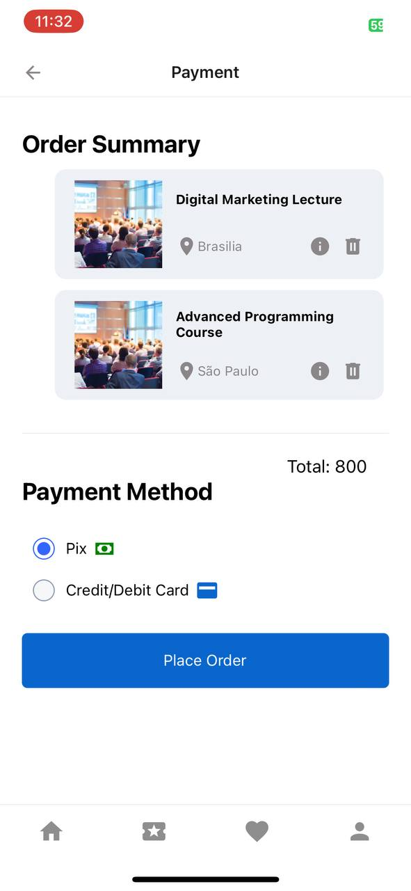

# Eventus

The Eventus software system is a mobile application developed in React Native that aims to provide a comprehensive solution for event management. The application allows users to search, view, and purchase tickets for events organized by local companies and universities. With an intuitive interface, Eventus simplifies the process of discovering, buying, and participating in events conveniently.

 

## How to use

`git clone https://github.com/isadoragalvaoss/eventus-app`

`npm install`

`npx expo start`

 

## Scrrenshots

<table>
  <tr>
    <td></td>
    <td></td>
    <td></td>
    <td></td>
  <tr>
  <tr>
    <td></td>
    <td></td>
    <td></td>
    <td></td>
  <tr>
  <tr>
    <td></td>
    <td></td>
  <tr>
</table>

 

# Dependencies

- React Native
- Redux
- React Navigation
- i18n
- Styled Components
- Ui Kitten
- React Hook Form
